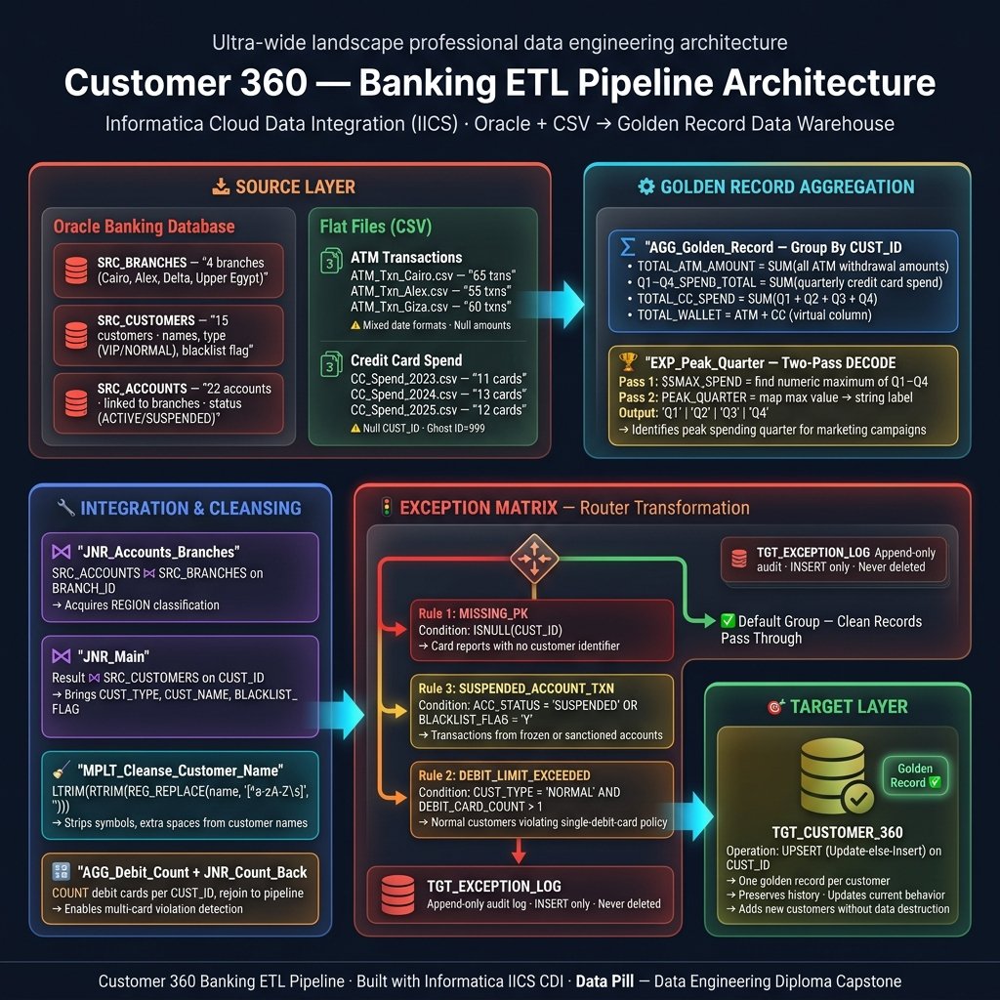

<div align="center">

# 🏦 Customer 360 — Banking ETL Pipeline

**Informatica Cloud Data Integration (IICS) &nbsp;|&nbsp; Oracle → Data Warehouse**

[](https://www.informatica.com/products/cloud-data-integration.html)
[](https://www.oracle.com/database/)
[](data/raw/)
[]()
[]()
[]()

---

*A production-grade multi-source ETL pipeline that consolidates banking, ATM, and credit card data  
into a single **Customer 360 golden record**, enforcing a strict three-rule exception matrix  
to quarantine non-conforming records before they reach the data warehouse.*

</div>

---

## 📋 Table of Contents

- [Business Objective](#-business-objective)
- [Architecture Overview](#️-architecture-overview)
- [Repository Structure](#️-repository-structure)
- [Pipeline Phases](#-pipeline-phases)
- [Exception Matrix](#-exception-matrix)
- [Key IICS Expressions](#-key-iics-expressions)
- [Source Data Inventory](#-source-data-inventory)
- [Quick Start](#️-quick-start)
- [Documentation](#-documentation)
- [Academic Context](#-academic-context)

---

## 📌 Business Objective

A regional Egyptian bank operates across **five governorates** with transactional data siloed across three distinct systems:

| System | Format | Contents |
|--------|--------|----------|
| Oracle Banking DB | Relational Tables | Branches, Customers, Accounts |
| ATM Network | CSV — per city | Daily cash withdrawal transactions |
| Credit Card Platform | CSV — per year | Quarterly card spend by customer |

**The pipeline must deliver:**

- ✅ **Name Cleansing** — strip illegal characters & normalize whitespace from `CUST_NAME`
- ✅ **Exception Enforcement** — three data quality rules with quarantine routing
- ✅ **Share of Wallet** — per-customer aggregation of ATM + CC spend
- ✅ **Peak Quarter Detection** — identify Q1/Q2/Q3/Q4 with highest spend for marketing
- ✅ **Safe Upsert** — update existing customers or insert new ones without data loss

---

## 🏗️ Architecture Overview

<div align="center">



</div>

<details>
<summary>📄 View text-based architecture diagram</summary>

```
╔══════════════════════════════════════════════════════════════╗
║                      SOURCE LAYER                           ║
║                                                              ║
║   ┌─── Oracle DB ───┐        ┌──── Flat Files (CSV) ──────┐  ║
║   │ SRC_BRANCHES    │        │ ATM_Txn_Alex.csv           │  ║
║   │ SRC_CUSTOMERS   │        │ ATM_Txn_Cairo.csv          │  ║
║   │ SRC_ACCOUNTS    │        │ ATM_Txn_Giza.csv           │  ║
║   └────────┬────────┘        │ CC_Spend_2023/24/25.csv    │  ║
║            │                 └──────────────┬─────────────┘  ║
╚════════════╪═════════════════════════════════╪══════════════╝
             │         IICS CDI Mapping        │
             └─────────────────┬───────────────┘
                               ▼
╔══════════════════════════════════════════════════════════════╗
║              INTEGRATION & CLEANSING LAYER                  ║
║                                                              ║
║   JNR: Accounts ⋈ Branches  →  JNR: + Customers            ║
║   MPLT_Cleanse_Customer_Name  (regex name sanitization)     ║
║   AGG: Count DEBIT cards per CUST_ID                        ║
║   JNR: Rejoin debit count to main pipeline                  ║
╚══════════════════════════════════════════════════════════════╝
                               │
                               ▼
╔══════════════════════════════════════════════════════════════╗
║               EXCEPTION MATRIX  (Router)                    ║
║                                                              ║
║   ┌─ Group 1: ISNULL(CUST_ID)                    ──────────►║─► TGT_EXCEPTION_LOG  'MISSING_PK'
║   ├─ Group 2: ACC_STATUS='SUSPENDED' OR BL='Y'   ──────────►║─► TGT_EXCEPTION_LOG  'SUSPENDED_ACCOUNT_TXN'
║   ├─ Group 3: NORMAL cust AND DEBIT_COUNT > 1    ──────────►║─► TGT_EXCEPTION_LOG  'DEBIT_LIMIT_EXCEEDED'
║   └─ Default: All clean records                  ──────────►║─► Next stage ✔
╚══════════════════════════════════════════════════════════════╝
                               │ clean records only
                               ▼
╔══════════════════════════════════════════════════════════════╗
║             GOLDEN RECORD AGGREGATION                       ║
║                                                              ║
║   AGG (Group by CUST_ID):                                   ║
║     • SUM(ATM AMOUNT)  →  TOTAL_ATM_AMOUNT                  ║
║     • SUM(Q1..Q4)      →  Q*_SPEND_TOTAL + TOTAL_CC_SPEND   ║
║   EXP: Two-pass DECODE  →  PEAK_QUARTER ('Q1'|'Q2'|...)     ║
╚══════════════════════════════════════════════════════════════╝
                               │
                               ▼
╔══════════════════════════════════════════════════════════════╗
║                      TARGET LAYER                           ║
║                                                              ║
║   TGT_CUSTOMER_360   ← UPSERT on CUST_ID                    ║
╚══════════════════════════════════════════════════════════════╝
```

</details>

---

## 🗂️ Repository Structure

```
customer-360-banking-etl/
│
├── 📁 data/
│   └── raw/
│       ├── atm_transactions/           ← ATM CSV files per city
│       │   ├── ATM_Txn_Alex.csv
│       │   ├── ATM_Txn_Cairo.csv
│       │   └── ATM_Txn_Giza.csv
│       └── credit_card_spend/          ← CC spend per year (Q1–Q4 breakdown)
│           ├── CC_Spend_2023.csv
│           ├── CC_Spend_2024.csv
│           └── CC_Spend_2025.csv
│
├── 📁 sql/
│   ├── source/
│   │   └── oracle_banking_db.sql       ← Source DDL + seed data
│   └── target/
│       ├── DDL_TGT_CUSTOMER_360.sql    ← Golden record target table (upsert)
│       └── DDL_TGT_EXCEPTION_LOG.sql   ← Append-only audit/quarantine log
│
├── 📁 iics/
│   ├── connections/
│   │   └── Connection_Specs.md         ← Oracle & Flat File connection parameters
│   ├── mapplets/
│   │   └── MPLT_Cleanse_Customer_Name.md  ← Reusable name-cleansing mapplet spec
│   └── mappings/
│       └── M_Customer_360_ETL.md       ← Full 6-phase mapping blueprint
│
├── 📁 docs/
│   ├── Business_Requirements_Document.pdf
│   └── Data_Dictionary.pdf
│
├── .gitignore
├── CHANGELOG.md
└── README.md
```

---

## 🔄 Pipeline Phases

<details>
<summary><strong>Phase 1 — Reference Data Integration</strong></summary>

### Joiner & Cleansing Chain

```
SRC_ACCOUNTS  ──┐
                 ├── JNR_Acct_Branch ──────────┐
SRC_BRANCHES  ──┘    (Detail)                  │
                                               ├── JNR_Master_Ref ──► To Final Assembly
SRC_CUSTOMERS ──► MPLT_Cleanse_Customer_Name ──┘  (Master)
```

The top stream focuses entirely on establishing the core customer dimension. It cleanses the customer names using a reusable mapplet and joins the relational Oracle tables to build a unified reference profile.

</details>

<details>
<summary><strong>Phase 2 — ATM Transaction Processing</strong></summary>

### Compliance & Aggregation

```
SRC_ATM_Regional ──► LKP_Account_Master ──► LKP_Customer_Compliance ──┐
                                                                      │
  ┌───────────────────────────────────────────────────────────────────┘
  │
  ▼
RTR_ATM_Compliance ──► (Clean) ────► EXP_Cast_ATM_Amount ──► AGG_Clean_ATM_Total ──► To JNR_ATM_CC
  │
  └──► (Exception) ──► TGT_EXCEPTION_LOG
```

This stream ingests daily ATM extracts. It performs connected lookups against the master data to verify account status and compliance. The router segregates invalid transactions, while clean records have their amounts safely cast to decimals and are aggregated per customer.

</details>

<details>
<summary><strong>Phase 3 — Credit Card Processing</strong></summary>

### Quality Checks & Aggregation

```
CC_Spend_*.csv ──► RTR_CC_Missing_PK ──► (Clean) ────► EXP_Cast_Spend_Metrics ──► AGG_CC_Spend_All_Years ──► To JNR_ATM_CC
                      │
                      └──► (Exception) ──► EXP_Hardcode_Missing_PK ──► TGT_EXCEPTION_LOG
```

The credit card stream handles quarterly spend data. It first enforces primary key presence via a router. Exceptional records (NULL or orphan IDs) are hardcoded with a rejection reason and sent to the audit log. Clean records are cast and aggregated across all years.

</details>

<details>
<summary><strong>Phase 4 — Golden Record Assembly</strong></summary>

### Final Joins & Metrics

```
AGG_Clean_ATM_Total     ──┐
                          ├──► JNR_ATM_CC ──┐
AGG_CC_Spend_All_Years  ──┘                 │
                                            ├──► JNR_Final_Master ──► EXP_Golden_Metrics ──► TGT_CUSTOMER_360
JNR_Master_Ref (from P1) ───────────────────┘
```

The aggregated transaction totals (ATM and CC) are joined together. That unified transaction data is then joined with the cleansed reference profile. The `EXP_Golden_Metrics` calculates the `TOTAL_WALLET` and the string label for the `PEAK_QUARTER` before performing an Upsert to the target database.

</details>

<details>
<summary><strong>Phase 5 — Upsert to Target</strong></summary>

| Setting | Value |
|---------|-------|
| Target Table | `TGT_CUSTOMER_360` |
| Operation | **Upsert** (Update-else-Insert) |
| Match Key | `CUST_ID` |
| Rationale | Preserves existing customer history while accommodating new enrollments |

The exception log target (`TGT_EXCEPTION_LOG`) is set to **Insert Only** — records are never updated or deleted to maintain a complete audit trail.

</details>

---

## ⚡ Exception Matrix

The exception logic is distributed across the data streams to catch errors as early as possible before aggregation.

| Rule | Stream | Router | Exception Code | Target |
|------|--------|--------|----------------|--------|
| **Rule 1** | CC Spend | `RTR_CC_Missing_PK` | `MISSING_PK` | `TGT_EXCEPTION_LOG` |
| **Rule 2** | ATM | `RTR_ATM_Compliance` | `DEBIT_LIMIT_EXCEEDED` | `TGT_EXCEPTION_LOG` |
| **Rule 3** | ATM | `RTR_ATM_Compliance` | `SUSPENDED_ACCOUNT_TXN` | `TGT_EXCEPTION_LOG` |

> [!NOTE]
> By separating the exception logic into stream-specific routers (`RTR_ATM_Compliance` and `RTR_CC_Missing_PK`), we avoid unnecessary processing of dirty data. Exceptions are identified immediately after lookups and routed directly to the audit log.

---

## 🔑 Key IICS Expressions

### 🧹 Name Cleansing — `MPLT_Cleanse_Customer_Name`

```
OUT_CUST_NAME = LTRIM(RTRIM(REG_REPLACE(CUST_NAME, '[^a-zA-Z\s]', '')))
```

### 📅 ATM Date Normalization — Mixed Format Handler

```
NORM_DATE = IIF(INSTR(TXN_DATE, '-') > 0,
              TO_DATE(TXN_DATE, 'YYYY-MM-DD'),
              TO_DATE(TXN_DATE, 'DD/MM/YYYY'))
```

> [!NOTE]
> ATM files contain two date formats (`2025-07-03` and `03/07/2025`) within the same column.  
> The `INSTR` check detects the format by looking for a hyphen, then routes to the appropriate `TO_DATE` conversion.

### 💰 Null Amount Guard — Safe Numeric Cast

```
SAFE_AMOUNT = IIF(ISNULL(AMOUNT) OR LENGTH(TRIM(TO_CHAR(AMOUNT))) = 0, 0, TO_DECIMAL(AMOUNT))
```

### 🏆 Peak Quarter Detection — Two-Pass DECODE

```sql
-- Pass 1 (Variable port $$): numeric maximum
$$MAX_SPEND = DECODE(TRUE,
  Q1 >= Q2 AND Q1 >= Q3 AND Q1 >= Q4, Q1,
  Q2 >= Q3 AND Q2 >= Q4,              Q2,
  Q3 >= Q4,                           Q3,
  Q4)

-- Pass 2 (Output port): string label
PEAK_QUARTER = DECODE($$MAX_SPEND, Q1,'Q1', Q2,'Q2', Q3,'Q3', 'Q4')
```

---

## 📊 Source Data Inventory

### Oracle Banking Database

| Table | Rows | Key Details |
|-------|------|-------------|
| `SRC_BRANCHES` | 4 | Regions: CAIRO, ALEX, DELTA, UPPER_EGYPT |
| `SRC_CUSTOMERS` | 15 | Includes 1 blacklisted (`CUST_ID=104`), 1 name with leading space (`105`), 1 with trailing spaces (`102`) |
| `SRC_ACCOUNTS` | 22 | 2 accounts are SUSPENDED (CUST_ID=104) |

### ATM Transaction Files

| File | Transactions | Known Issues |
|------|-------------|--------------|
| `ATM_Txn_Cairo.csv` | 65 | 2 rows with NULL `AMOUNT` (TXN_1006, TXN_1027) |
| `ATM_Txn_Alex.csv` | 55 | Mixed date formats throughout |
| `ATM_Txn_Giza.csv` | 60 | 1 row with NULL `AMOUNT` (TXN_3048) |

### Credit Card Spend Files

| File | Cards | Anomalies |
|------|-------|-----------|
| `CC_Spend_2023.csv` | 11 | `CARD_50009` → NULL CUST_ID &nbsp;&#124;&nbsp; `CARD_50010` → Ghost CUST_ID=999 |
| `CC_Spend_2024.csv` | 13 | `CARD_60011` → NULL CUST_ID &nbsp;&#124;&nbsp; `CARD_60012` → Ghost CUST_ID=999 |
| `CC_Spend_2025.csv` | 12 | `CARD_70010` → NULL CUST_ID &nbsp;&#124;&nbsp; `CARD_70011` → Ghost CUST_ID=999 |

> [!IMPORTANT]
> `CUST_ID = 999` is a **ghost record** — it appears in all three CC spend files but has no corresponding row in `SRC_CUSTOMERS`. These records will pass the `MISSING_PK` rule (CUST_ID is not null) but will fail a referential integrity check at load time. Consider adding a **Lookup transformation** against `SRC_CUSTOMERS` to catch orphaned foreign keys.

---

## 🛠️ Quick Start

> [!NOTE]
> You must execute the **target DDL scripts before** building any IICS mappings.  
> IICS cannot configure a Target transformation without the endpoint tables existing in the database.

### Prerequisites

| Requirement | Version |
|-------------|---------|
| Oracle Database | 19c+ (or compatible) |
| Informatica IICS Tenant | CDI license required |
| IICS Secure Agent | Must have network reach to Oracle host |

### Step 1 — Provision Source Schema

```sql
-- Run against your Oracle source instance
@sql/source/oracle_banking_db.sql
```

### Step 2 — Provision Target Schema

```sql
-- Run against your Oracle target instance (may be same DB, different schema)
@sql/target/DDL_TGT_CUSTOMER_360.sql
@sql/target/DDL_TGT_EXCEPTION_LOG.sql
```

### Step 3 — Configure IICS Connections

Register three connections in IICS → **Administrator → Connections**:

```
CONN_Oracle_Banking_DB    (Oracle)
CONN_FF_ATM_Transactions  (Flat File → data/raw/atm_transactions/)
CONN_FF_CC_Spend          (Flat File → data/raw/credit_card_spend/)
```

Full parameter reference: [`iics/connections/Connection_Specs.md`](iics/connections/Connection_Specs.md)

### Step 4 — Build IICS Assets (in order)

```
1. 📦  Mapplet   →  MPLT_Cleanse_Customer_Name    (iics/mapplets/)
2. 🗺️  Mapping   →  M_Customer_360_ETL            (iics/mappings/)
3. ▶️  Task      →  Mapping Task wrapping M_Customer_360_ETL
```

---

## 📄 Documentation

| Document | Description | Link |
|----------|-------------|------|
| 📊 Project Presentation | Executive overview and pipeline architecture presentation | [View Presentation](https://yorwjbzc.gensparkspace.com/) |
| 📋 Business Requirements | Functional specs, exception rules, acceptance criteria | [BRD.pdf](docs/Business_Requirements_Document.pdf) |
| 📖 Data Dictionary | Column-level definitions for all source and target tables | [Data_Dictionary.pdf](docs/Data_Dictionary.pdf) |
| 🗺️ Mapping Blueprint | Full 6-phase IICS mapping technical specification | [M_Customer_360_ETL.md](iics/mappings/M_Customer_360_ETL.md) |
| 📦 Mapplet Spec | Expression logic, test cases for name cleansing mapplet | [MPLT_Cleanse_Customer_Name.md](iics/mapplets/MPLT_Cleanse_Customer_Name.md) |
| 🔌 Connection Specs | IICS connection parameters + data quality notes | [Connection_Specs.md](iics/connections/Connection_Specs.md) |
| 📝 Changelog | Version history in Keep-a-Changelog format | [CHANGELOG.md](CHANGELOG.md) |

---

## 🎓 Academic Context

<div align="center">

| | |
|---|---|
| 🏫 **Institute** | Data Pill |
| 📚 **Program** | Data Engineering Diploma |
| 🧪 **Project Type** | Capstone — End-to-End ETL Implementation |
| 🛠️ **Primary Tool** | Informatica Intelligent Cloud Services (IICS) — Cloud Data Integration |
| 🧠 **Concepts Covered** | Multi-source integration · Router transformation · Aggregator transformation · Mapplets · Upsert strategy · Data quality exception handling · Peak quarter analytics |

</div>

---

## 📜 License

> This project is developed for **educational purposes only**.  
> All data is entirely synthetic and does not represent real banking customers, accounts, or transactions.

---

<div align="center">

Made with ❤️ as part of the **Data Engineering Diploma** at **Data Pill**

[](https://www.oracle.com/)
[](https://www.informatica.com/)
[]()
[]()

</div>
